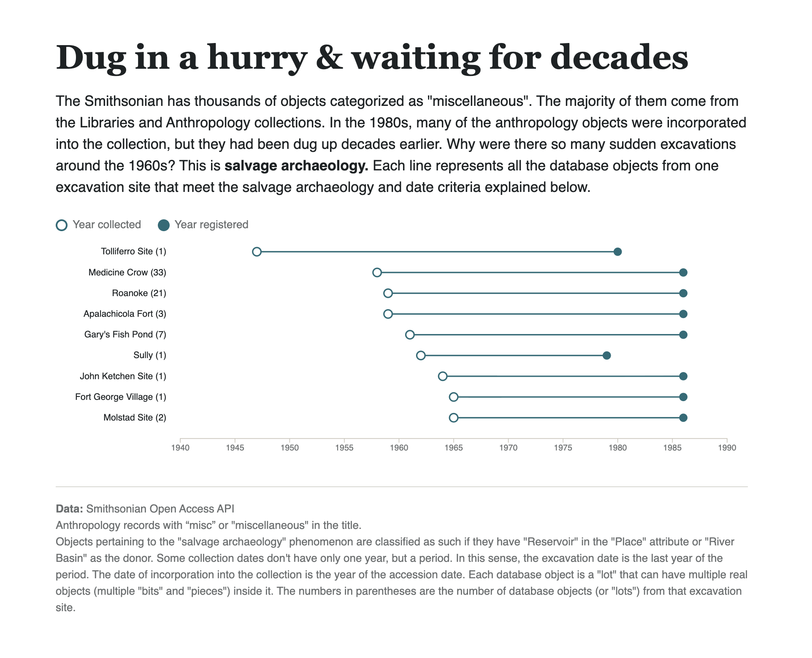

# Dug in a hurry & waiting for decades

The majority of objects tagged as "miscellaneous" from the Smithsonian Open Access API come from the Libraries and Anthropology collections. The latter has several objects that were incorporated into the museum's collection after the phenomenon known as "salvage archaeology". This phenomenon was fueled by the idea that if preservation efforts weren't taken to retrieve old objects from modern development building plans, they would be lost. As a result, many of these objects were dug up before the water covered the terrain. Curiously enough, these objects were incorporated into the collections much later.

The graph required a complex mix of elements from the Smithsonian's database. First, it meant filtering all the objects from the Anthropology collection with the words "misc" and "miscellaneous" in the title field. Each database object is a "lot" that can have multiple real objects (multiple "bits" and "pieces") inside it. Then, all the database objects (or "lots") had to be grouped by excavation site. It was also necessary to develop a methodology to establish if they came from salvage archaeology. To do so, it was defined that such objects were the ones that had "Reservoir" in their place of origin or had "River Basin" as the donor.



# Evolution of the pseudocode

Pseudocode was used to start building the chart. What follows is a summary of the evolution of the pseudocode and the feedback given by an LLM. The summary itself has also been retrieved from the chat with the LLM.

## v1: First draft
The first idea, written in natural language.

1. Take the JSON, go through all the elements and look for `content.freetext.date.content`
2. Take the last 4 digits and save them
3. Count how many objects there are per year (0 if none)
4. Draw a bar per year
5. Go through the objects again, look for a collection date and the excavation, and sort it

**Problems found:**
- `date` is a **list**, so you have to look inside it for the entry with the right `label`
- Missing years never appear in a grouping, so you first need a list of **every year**
- The dumbbells had no filter: they would include every site in the world, not only salvage ones

---

## v2: Labels and missing values
- Look for the entry whose label is **"Accession Date"**
- Skip objects without an accession date
- Build the list of years from the **min to the max**
- Use `geoLocation.L5` to find the reservoir

**Problems found:**
- `L5` is not always the reservoir (sometimes a city, sometimes missing)
- There was still no salvage filter
- Dumbbells must be grouped by **site**, not by reservoir

---

## v3: The salvage filter
- New step: keep only salvage objects
- First attempt: filter by country ("United States"), which was too broad and rejected
- Final rule: **"Reservoir" as place OR "River Basin" as donor**
  - It has to be **OR**, not AND: with AND, Black Partizan (88 lots) would be lost
  - It has to be **"contains"**, not "equals": donor names are written in different ways
- The site name is in `content.freetext.name`, label **"Site Name"** (not in `date`, and not always in the same position)

---

## v4: Collection dates are periods
Discovery: a collection date can be a period (**"1946 to 1965"**). This happens in 124 of 266 dates, because one record is a **lot** of many fragments, sometimes collected over several seasons.

- "Last 4 digits" only gives the last year
- Options discussed: first year, midpoint, last year, or the whole period
- Checked with the data:
  - For salvage, the wait is about **27–28 years** whatever you choose
  - For non-salvage, it goes from 6 to 62 years depending on the choice, so the comparison "27 vs 6" was **dropped** as not reliable
- New drawing: **brackets** `[ ── ]` for the collection period and for the registration year, joined by a line

---

## v5: Full version (bars + brackets)
Order fixed so that you **calculate before you draw** and **sort before you draw**.

- **A. Load:** take the JSON
- **B. Bars:** accession year, salvage check, min/max years, counts per year (total + salvage), grey bar + coloured bar
- **C. Filter and group:** salvage objects with a site name, grouped by site
- **D. Dates:** collection and accession years, count of objects, smallest and biggest years per site
- **E. Draw:** sort by earliest collection year, draw brackets and the line between them

Written in English, keeping the original wording. A version with helper functions (`getListOrEmpty`, `findContentByLabel`) was tried and then dropped, to keep only basic JS.

---

## v6: Simplified version (only dumbbells)
With little time left, the scope was cut:

- **No bar chart:** only the salvage sites are shown
- **No periods:** the last 4 digits of each date (the wait shown is the minimum)
- **No min/max:** the dates of the first object of each site are used. Sites are sorted by collection year.
- **One single loop** for everything
- **Dots and a line** instead of brackets

---

## v7: Final version

```
// 1. Take the JSON
// 2. Go through all the elements
// 3. Take content.freetext.date.content when the label is "Accession Date", and also when it is "Collection Date"
// 4. Take content.freetext.name.content when the label is "Site Name", and also when it is "Donor Name"
// 5. Check if it is salvage: it has "Reservoir" as place or "River Basin" as donor
// 6. If it is not salvage, or it doesn't have a site name, an accession date or a collection date, skip it
// 7. From the accession date and the collection date take the last four digits and transform them into numbers
// 8. Look for the site in the list of sites. If it isn't there, create it with these two dates
// 9. Count one more lot for this site
// 10. Sort the sites by the oldest collection year
// 11. For each site, in a new row:
// 12. Draw a line between the collection date and the accession date
// 13. Draw a dot at the collection date and another one at the accession date
// 14. Write the site name and the number of lots to the left
```